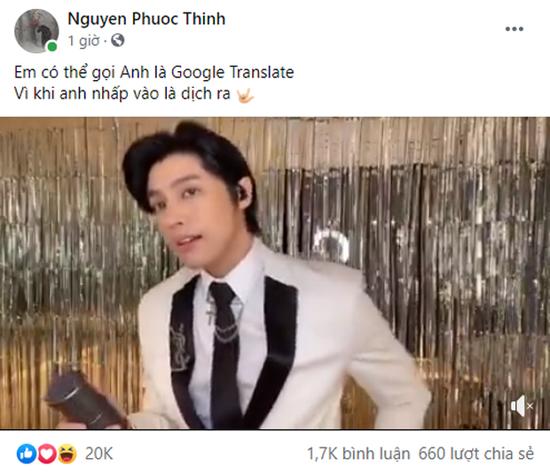

<p align="center">
  
</p>

<h1 align="center">nuphuocthinh</h1>
<p align="center">Tool dịch videos của iemhanh</p>
<p align="center">sản phẩm vừa lọ vừa đè tem của iemhanh</p>

## Giới thiệu

**nuphuocthinh** là công cụ nhận dạng, dịch phụ đề, thuyết minh và chỉnh sửa video trên máy cá nhân.

Khi mở ứng dụng, popup chào mừng hiển thị ảnh giới thiệu. Bấm **Bắt đầu dịch videos**, nút đóng hoặc Escape để vào công cụ. Popup xuất hiện lại khi mở ứng dụng hoặc tải lại trang, không xuất hiện lại khi chuyển trang trong cùng phiên giao diện.



## Tính năng

- Nhập video và chỉnh sửa trên timeline nhiều lớp.
- Nhận dạng lời nói bằng ASR, quét phụ đề có sẵn trong video bằng OCR.
- Dịch phụ đề bằng Google Dịch, OpenRouter hoặc API tương thích tùy chỉnh.
- Thuyết minh/TTS, quản lý giọng nói, clone giọng và tách âm thanh tùy runtime/nhà cung cấp được cấu hình.
- Căn chỉnh phụ đề, che phụ đề gốc, thêm lớp phủ và hiệu ứng.
- Xuất video; nhập/xuất dự án `.ldvproj` kèm media để sao lưu hoặc chuyển máy.
- Chạy trên trình duyệt hoặc ứng dụng desktop Windows.

## Chạy ứng dụng

### Tải bản Windows

Mở [Releases](https://github.com/huyanhdeptrai/nuphuocthinh/releases/latest), tải file `nuphuocthinh.Setup.…exe` trong mục **Assets** và chạy để cài đặt.

### Chạy từ mã nguồn

Yêu cầu: Node.js và Bun. Mở terminal trong thư mục `nuphuocthinh`:

```powershell
bun install
bun run dev:web
```

Mở [http://localhost:4000](http://localhost:4000).

Để chạy bản desktop trong chế độ phát triển:

```powershell
bun run dev:desktop
```

ASR/OCR/TTS chạy local có thể cần runtime Python, model và FFmpeg tương ứng. Cài các thành phần cần thiết trong giao diện hoặc dùng script trong `scripts/`; chỉ bật GPU khi máy và runtime hỗ trợ.

## Quy trình sử dụng

1. Đóng popup chào mừng và tạo/mở dự án.
2. Nhập video, nhận dạng ASR hoặc OCR để lấy phụ đề.
3. Chọn nhà cung cấp dịch và ngôn ngữ đích, rồi dịch phụ đề.
4. Kiểm tra câu dịch và áp dụng lên timeline.
5. Tạo thuyết minh nếu cần, căn chỉnh âm thanh và xuất video.
6. Xuất `.ldvproj` để giữ bản sao dự án và media.

### Google Dịch

Lựa chọn Google Dịch dùng kết nối GTX có sẵn trong mã kế thừa, không yêu cầu nhập API key. Phụ đề được gửi tới Google khi bấm dịch. Đây không phải tích hợp Google Cloud Translation API được cấu hình bằng tài khoản riêng; kết nối có thể bị giới hạn hoặc ngừng hoạt động.

Google Dịch phù hợp để dịch nhanh. Các prompt phong cách và vai nhân vật của chế độ AI không áp dụng cho lựa chọn này. Khi dịch lỗi, ứng dụng hiển thị lỗi thay vì coi câu gốc là bản dịch thành công.

## Đóng gói Windows

```powershell
bun run dist:win
```

Bản cài đặt nằm trong `apps/desktop/dist/`. Bước chuẩn bị desktop yêu cầu runtime OCR; nếu chưa có, chạy:

```powershell
powershell -ExecutionPolicy Bypass -File scripts/prepare-ocr-runtime.ps1
```

## Bố cục dự án

| Thư mục | Nội dung |
| --- | --- |
| `apps/web/` | Giao diện web, editor và API |
| `apps/desktop/` | Electron, icon Windows và cấu hình đóng gói |
| `apps/web/public/brand/nuphuocthinh/` | Logo gốc, ảnh giới thiệu và icon PWA |
| `apps/web/public/icons/` | Icon trình duyệt/thiết bị được tạo từ logo |
| `apps/web/src/components/welcome-dialog.tsx` | Popup chào mừng |
| `packages/` | Các package dùng chung |
| `scripts/` | Script phát triển, chuẩn bị runtime và đóng gói |

Tài nguyên thương hiệu:

- `apps/web/public/brand/nuphuocthinh/logo.png`
- `apps/web/public/brand/nuphuocthinh/introduction.webp`
- `apps/web/public/brand/nuphuocthinh/icon-512.png`

## Dữ liệu và kết nối mạng

Dự án/media được lưu trên thiết bị qua IndexedDB và OPFS. Ứng dụng đã gỡ tracker Tianji, gửi góp ý về tác giả, thư viện Vercel Analytics, BotID và thông tin donate.

Các tính năng Google Dịch/AI cloud vẫn gửi nội dung tới nhà cung cấp khi sử dụng. GPU/TTS có thể kết nối GitHub để kiểm tra và tải runtime; font và một số tài nguyên khác cũng có thể cần mạng. Đây không phải bản hoàn toàn offline.

API key phải dùng tài khoản của bạn và không đưa lên Git. Cách lưu một số key hiện tại chưa mã hóa; dùng máy cá nhân đáng tin cậy. Bản này hướng tới sử dụng local, chưa được gia cố để mở API ra Internet.

Định dạng `.ldvproj`, các khóa lưu trữ, biến môi trường cũ và thư mục dữ liệu desktop `Lemyloi-dichvideo` được giữ tương thích để tiếp tục mở dự án và runtime đã có. Những định danh kỹ thuật này không phải tracker.

## Kiểm tra

```powershell
bun test apps/web/src/dubbing/services/translation.test.ts apps/web/src/services/storage/project-package.test.ts apps/web/src/dubbing/server/runtime-paths.test.ts
```

## Nguồn mã và giấy phép

Mã nền kế thừa từ Lemyloi-dichvideos, Editkub, msgbyte/cutia và OpenCut. Các thông báo bản quyền và điều kiện MIT của mã kế thừa được giữ trong [LICENSE](LICENSE). Giấy phép riêng của thư viện, model, giọng nói và dịch vụ bên thứ ba vẫn áp dụng.
